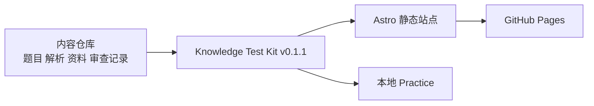

# ML Compiler Knowledge Test

从计算图到 GPU Kernel，从编译优化到 LLM 推理系统。

400 道面向工程实践的选择题，覆盖 ML Compiler、CUDA、Triton、量化与高性能推理。仓库只维护内容资产、审查记录与薄集成层；站点渲染、搜索、Practice 与评分逻辑统一由 **Knowledge Test Kit v0.1.1** 提供。

[](https://clt123321.github.io/ml-compiler-knowledge-test/)
[](https://clt123321.github.io/ml-compiler-knowledge-test/)
[](./reviews/)
[](./.github/workflows/ci.yml)
[](https://github.com/clt123321/knowledge-test-kit/tree/v0.1.1)
[](./LICENSE)

**[在线浏览](https://clt123321.github.io/ml-compiler-knowledge-test/)** | **[开始做题](https://clt123321.github.io/ml-compiler-knowledge-test/practice/)** | **[查看考纲](./docs/SYLLABUS.md)** | **[本地运行](#一分钟开始)** | **[参与贡献](./CONTRIBUTING.md)**

## 这是什么

这是一个可独立使用、适合长期维护的 ML Compiler 知识题库产品。你克隆当前仓库即可获得：

- 静态知识站与单题页面
- 全文搜索与模块浏览
- 模块练习、随机组卷与结果页
- 单选 / 多选、置信度、错题记录与 `localStorage`
- KaTeX 公式、代码片段、IR 片段与来源索引
- 无后端、无登录、无追踪的本地 Practice 体验

## 一分钟开始

在线体验：

`https://clt123321.github.io/ml-compiler-knowledge-test/`

本地运行：

```bash
git clone https://github.com/clt123321/ml-compiler-knowledge-test.git
cd ml-compiler-knowledge-test
npm run dev
```

> 首次启动会自动下载固定版本的 Knowledge Test Kit `v0.1.1`，并校验其 commit 为 `5d58632122590adb66c6712f0dcf301fe8fb1e36`。用户不需要额外克隆第二个仓库，也不需要先在当前仓库执行 `npm install`。

常用命令：

```bash
npm run dev
npm run build
npm run preview
npm run doctor
npm run inspect
npm run site:validate
```

## 考纲

| 模块 | 题数 | 核心主题 |
|------|-----:|-----------|
| A. 计算机体系结构与性能模型 | 30 | Roofline、存储层次、并行执行模型、性能直觉 |
| B. 编译器基础与程序分析 | 25 | CFG、SSA、数据流分析、经典优化 |
| C. 计算图、张量程序与中间表示 | 30 | Graph IR、Tensor IR、Shape、Layout、Lowering |
| D. PyTorch Compiler 与动态图捕获 | 35 | TorchDynamo、AOTAutograd、TorchInductor、Graph Break |
| E. MLIR / TVM / XLA 与编译器生态 | 30 | MLIR、TVM、XLA、StableHLO、IREE、ONNX |
| F. CUDA / Triton / GPU Kernel | 40 | CUDA 执行模型、Triton Kernel、Memory Access、Tensor Core |
| G. 图优化 / 循环变换 / 调度 / 自动调优 | 30 | Fusion、Tiling、Loop Transform、Cost Model、Autotuning |
| H. 数值表示、混合精度与模型量化 | 35 | FP16/BF16/FP8、PTQ/QAT、校准、量化与硬件约束 |
| I. 核心算子、融合 Kernel 与 Attention | 30 | GEMM、Norm、Attention、融合 Kernel 与数据流 |
| J. LLM 推理优化与生成系统 | 30 | Prefill/Decode、KV Cache、Continuous Batching、Serving |
| K. Runtime、模型交换与部署 | 30 | AOT、交换格式、Runtime、部署链路与兼容性 |
| L. Profiling / Benchmark / Debug / 正确性 | 30 | Nsight、Benchmark、性能归因、正确性验证 |
| M. 分布式、通信编译与异构执行 | 15 | 并行策略、通信代价、异构协同 |
| N. 论文设计、系统权衡与研究判断 | 10 | 论文动机、系统权衡、研究结论判断 |

完整学习范围见 [docs/SYLLABUS.md](./docs/SYLLABUS.md) 与 [docs/LEARNING_PATH.md](./docs/LEARNING_PATH.md)。

## 题库可信度

当前题库状态如下：

- 400 道题，14 个模块
- 392 道 `agent_reviewed`
- 8 道 `draft`，默认不进入公开站点与 Practice
- 0 道 `human_reviewed`
- 0 道 `deprecated`

题目经过内容卡生成、去答案盲审、定向修复与独立复核。仓库保留 `reviews/`、`handoffs/`、`exports/` 中的审查证据，但不会自动把任何题目标记为 `human_reviewed`。

## 架构



这个仓库不复制 Kit 的 Astro/React 源码。`scripts/kit-runner.mjs` 会在首次运行时把固定版本 Kit 缓存到 `.cache/knowledge-test-kit/v0.1.1`，随后统一通过 `npm run dev` / `npm run build` 调用。

## 资料体系

资料索引覆盖至少：

- 6 本核心书籍
- 15 篇核心论文
- 22 份官方文档
- 4 条学习路径

完整资料见 [references/BOOKS.md](./references/BOOKS.md)、[references/PAPERS.md](./references/PAPERS.md)、[references/OFFICIAL_DOCS.md](./references/OFFICIAL_DOCS.md) 与 [docs/LEARNING_PATH.md](./docs/LEARNING_PATH.md)。

## 仓库结构

```text
data/questions/         题目 JSON
data/content-cards/     内容卡
references/             资料索引与来源登记
reviews/                盲审、修复、复核与升级留痕
exports/                导出产物与审计结果
scripts/                内容校验脚本与 Kit runner
docs/                   架构、内容规范、维护文档
modules.json            Kit 兼容层模块清单
knowledge-test.config.json
```

## 开源维护

先读这三份文档：

- [CONTRIBUTING.md](./CONTRIBUTING.md)
- [docs/CONTENT_GUIDE.md](./docs/CONTENT_GUIDE.md)
- [docs/ARCHITECTURE.md](./docs/ARCHITECTURE.md)

小修复可以直接提 PR；涉及答案、解析结论、状态或版本敏感字段的修改，必须重新经过复核流程并更新相应审查记录。当前维护重点是持续修正文档集成层、升级 Kit 兼容性，并逐步推进 `draft` 题目的人工确认。

## License

本项目使用 [MIT License](./LICENSE)。
