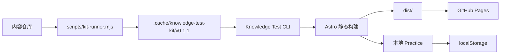

# ARCHITECTURE.md

## 目标

这个仓库现在是一个内容优先的知识题库产品仓库：

- 仓库拥有题目、解析、资料、审查记录和薄集成层
- 站点渲染、搜索、Practice、评分与本地存储由固定版本的 Knowledge Test Kit 提供
- 普通用户只需要克隆当前一个仓库

## 核心结构

```text
data/questions/         400 道题目
data/content-cards/     命题内容卡
references/             书籍、论文、官方文档、来源登记
reviews/                盲审、修复、复核、升级留痕
exports/                审计报告、导出产物、覆盖统计
scripts/                内容脚本 + kit-runner.mjs
docs/                   维护文档
modules.json            Kit 使用的模块清单
knowledge-test.config.json
```

## 运行架构



## 为什么只克隆一个仓库

这是这次重构最重要的产品决策。

用户运行 `npm run dev` 时：

1. `scripts/kit-runner.mjs` 检查 Node、Git、npm
2. 优先读取 `KNOWLEDGE_TEST_KIT_DIR`
3. 如未指定，则自动把 Kit `v0.1.1` 克隆到 `.cache/knowledge-test-kit/v0.1.1`
4. 校验标签 `v0.1.1` 对应 commit 是否为 `5d58632122590adb66c6712f0dcf301fe8fb1e36`
5. 如无 `node_modules`，自动执行 `npm ci --prefix <kit-dir>`
6. 调用 Kit CLI，并自动附加 `--content <当前仓库绝对路径>`

这样做的结果是：

- 内容仓库保持轻量
- Kit 版本固定、可复现
- 普通用户不需要理解 monorepo、submodule 或双仓协作
- Kit 开发者仍可通过 `KNOWLEDGE_TEST_KIT_DIR=../knowledge-test-kit npm run dev` 做本地覆盖测试

## 内容与站点的边界

本仓库负责：

- `data/questions/`
- `data/content-cards/`
- `references/`
- `reviews/`
- `exports/`
- 内容校验、审计与导出脚本
- 产品配置与 GitHub Pages 工作流

Knowledge Test Kit 负责：

- Astro 页面
- Pagefind 搜索
- Practice 交互
- 评分逻辑
- 页面路由与静态构建
- 浏览器端 `localStorage` 持久化

## 配置边界

`knowledge-test.config.json` 是内容仓库与 Kit 的契约文件，重点包含：

- `content.questionGlobs`
- `content.referenceGlobs`
- `content.syllabusGlobs`
- `content.moduleFile`
- `review.publicStatuses`
- `review.practiceStatuses`
- `exam.*`

其中 `modules.json` 是一层兼容文件，用来把原有 `manifests/` 映射为 Kit 可直接消费的模块列表，避免移动 14 个 manifest 或 400 道题。

## 构建与产物

- `npm run build` 调用 Kit 构建 Astro 站点
- Kit 的构建产物会同步到当前仓库根下的 `dist/`
- `dist/` 不入库，由 `.gitignore` 管理
- `npm run preview` 会先执行一次构建，再预览当前仓库的站点内容

## GitHub Pages

Pages 部署不再由本仓库自建前端，而是复用：

`clt123321/knowledge-test-kit/.github/workflows/deploy-content-site.yml@v0.1.1`

内容仓库只需要维护自己的：

- `knowledge-test.config.json`
- `.github/workflows/pages.yml`

## localStorage

Practice 结果、置信度和错题记录只保存在浏览器本地 `localStorage`，不依赖服务端数据库，也不要求登录。

## 维护原则

- 不复制 Kit 完整源码到内容仓库
- 不在当前仓库再创建一套 Astro、React 或 Vite 前端
- 不修改题目技术结论、正确答案和审核状态，除非是明确的内容修复流程
- 升级 Kit 时必须固定新版本并重新验证
